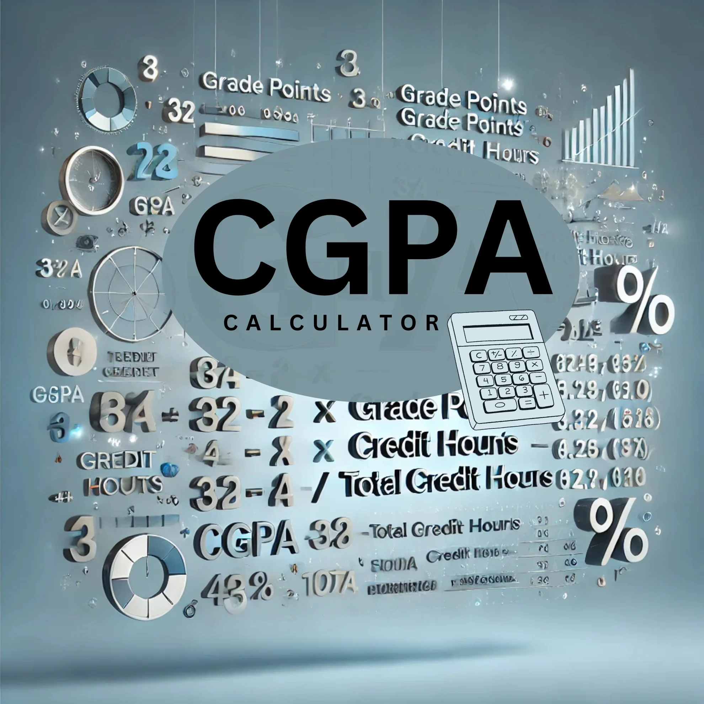

# 🎓 SGPA & CGPA Calculator – Academic Performance Tracker



A beautiful and dynamic web application to help students calculate and track their **SGPA (Semester Grade Point Average)** and **CGPA (Cumulative Grade Point Average)** with ease. Built using **HTML**, **CSS**, **JavaScript**, and **Tailwind CSS**, this project is fully interactive, responsive, and designed with user experience in mind.

---

## 🚀 Features

✅ **Add Multiple Semesters**  
✅ **Add/Delete Subjects Dynamically**  
✅ **Real-Time SGPA & CGPA Calculation**  
✅ **Animated Performance Chart using Chart.js**  
✅ **Save/Load Data with Local Storage**  
✅ **Achievement System with Confetti Effects**  
✅ **Academic Templates for Engineering, Business, and Arts**  
✅ **Performance Status Panel (Excellent, Good, Average, Needs Improvement)**  
✅ **Responsive Design & Smooth Animations**

---

## 📸 Screenshots

| Main Interface | Performance Chart |
|----------------|-------------------|
|  | *(Chart is dynamically rendered in-app)* |

---

## 🛠️ Technologies Used

- **HTML5**
- **CSS3**
- **Tailwind CSS**
- **JavaScript (ES6+)**
- **Chart.js** (for graphs and data visualization)
- **Font Awesome** (icons)

---


---

## 📈 How It Works

1. **Add semesters** and enter subjects with corresponding **credits** and **grades**.
2. The app calculates:
   - **SGPA** for the current semester.
   - **CGPA** across all semesters.
3. Visual data like charts and progress rings animate in real-time.
4. Save or load your progress using browser **LocalStorage**.

---

## 🧠 Grade Scale Used

| Grade | Percentage | Points |
|-------|------------|--------|
| O     | 90–100     | 10     |
| A+    | 80–89      | 9      |
| A     | 70–79      | 8      |
| B+    | 60–69      | 7      |
| B     | 50–59      | 6      |
| F     | <50        | 0      |

---

## 🧑‍🎓 Ideal For

- College/University students
- Educators wanting to demonstrate GPA logic
- Learners building interactive JavaScript apps

---

## 📦 How to Use

1. **Download or clone** this repository:
   ```bash
   git clone https://github.com/your-username/sgpa-cgpa-calculator.git


